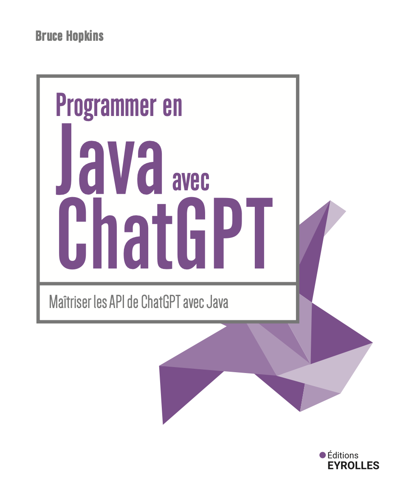

# Code Source Éditions Eyrolles

Ce référentiel accompagne [*Programmer en Java avec ChatGPT*](https://www.eyrolles.com) de Bruce Hopkins (Éditions Eyrolles, 2024).

[comment]: #cover

Téléchargez les fichiers au format zip en utilisant le bouton vert, ou clonez le dépôt sur votre machine en utilisant Git.

## Communiqués

La version v1.0 correspond au code du livre publié et comprendra des mises à jour et des corrections si nécessaire.

## Contributions

Voir le fichier Contributing.md pour plus d'informations sur la façon dont vous pouvez contribuer à ce dépôt.